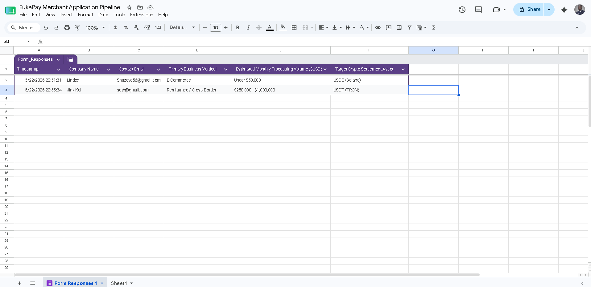
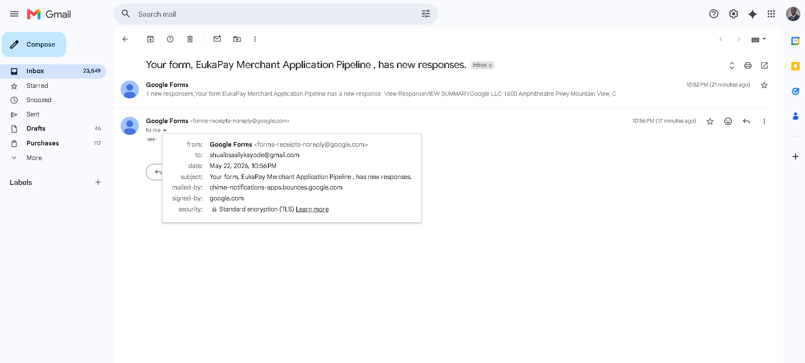

# Automated Merchant Onboarding & Risk-Scoring Engine 🚀

An automated Go-To-Market (GTM) infrastructure tool designed using Google Apps Script to streamline enterprise B2B merchant intake, execute automated conditional risk assessments, and dynamically calculate processing fee structures in real time.

---

## 🔒 Intellectual Property & Copying Warning
Copyright (c) 2026 Shuaib Kayode. All rights reserved. 

The architectural patterns demonstrated here are intended solely as a portfolio showcase for professional hiring managers. Re-use, distribution, or direct copying of the underlying implementation calculations without explicit attribution is strictly prohibited.

---

## 📌 Project Overview
In high-velocity payment processing sectors (such as iGaming, Cross-Border Remittance, and Web3 Platforms), manual onboarding workflows introduce friction, delay time-to-revenue, and strain compliance operations. 

This project demonstrates a scalable infrastructure prototype designed for modern payment gateways like **EukaPay**. It acts as an automated intake funnel that programmatically evaluates institutional client transaction volumes and industry verticals, scores risk exposure, and instantly dispatches a customized commercial contract framework directly to the client's inbox within 15 seconds.

### 🔄 System Architecture & Workflow Pipeline
1. **Intake Interface:** A user-facing frontend application gateway (Google Form) captures critical operational metrics.
2. **Relational Database Node:** Submissions are streamed directly into an active database ledger sheet.
3. **Risk & Fee Compute Logic:** A serverless backend execution environment (Google Apps Script) intercept triggers on-form-submit.
4. **Dynamic Settlement Notification:** Custom conditional calculations evaluate metrics and dispatch a custom B2B proposal.

---

## 🛠️ Logic Matrix (Commercial Tiering Overview)

The production execution script evaluates risk and builds customized commercial terms dynamically using the following operational matrix:

| Primary Vertical | Monthly Volume Range | Risk Profile | Assigned Account Tier | Target Processing Fee |
| :--- | :--- | :--- | :--- | :--- |
| **iGaming / Betting** | Over $250,000 | High Risk (Volume Adjusted) | Enterprise iGaming Tier | **1.8%** |
| **iGaming / Betting** | Under $250,000 | High Risk (Standard) | SME iGaming Tier | **2.5%** |
| **Remittance / Crypto Platforms** | Over $250,000 | Medium Risk (Enterprise) | Global Liquidity Tier | **0.9%** |
| **Remittance / Crypto Platforms** | Under $250,000 | Medium Risk (Standard) | Core Gateway Tier | **1.5%** |
| **E-Commerce / Digital Media** | Any Volume | Standard Risk | Standard Growth Partner | **2.0%** |

---

## 📊 Core Business & Operational Impact
* **Reduces Sales Cycles:** Cuts median B2B contract onboarding negotiations from days down to a 15-second instant automated response block.
* **Optimizes Compliance Allocation:** Filters standard/medium-risk pipelines instantly, freeing specialized risk teams to handle complex escrow or high-risk compliance parameters manually.
* **Data-Backed Sourcing:** Preserves transaction records for seamless review inside corporate database architectures.

## 📊 System Proof & Live Execution Logs

### Automated Intake Database Ledger Node

### Dynamic Commercial Proposal Dispatch Email

